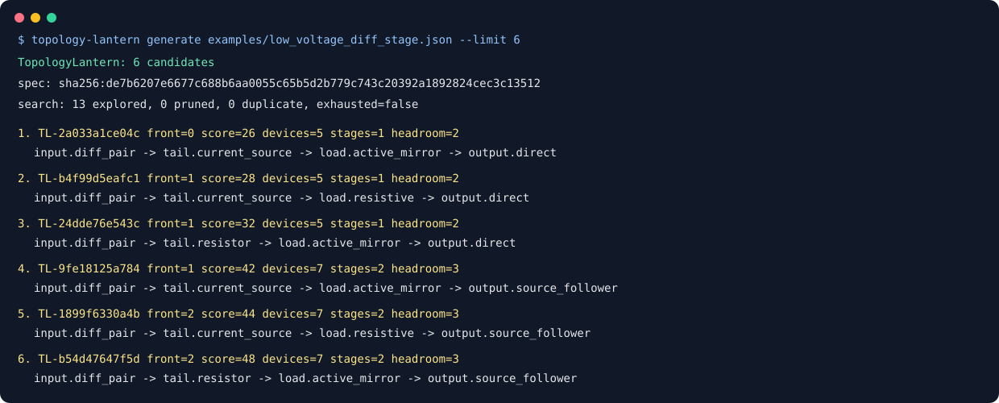

# TopologyLantern

[](https://github.com/appleweiping/TopologyLantern/actions/workflows/ci.yml)
[](https://github.com/appleweiping/TopologyLantern/actions/workflows/codeql.yml)
[](https://www.python.org/)
[](LICENSE)

TopologyLantern generates a small, deterministic set of conceptual analog
topology candidates from explicit design intent. Every candidate includes a
rule-by-rule derivation, structural review notes, identifier-independent graph
signature, transparent metrics, Pareto front, and replayable trace.

The generator is deliberately offline and unsized. It does not call an LLM, a
simulator, a PDK, or an optimizer, and it does not claim electrical performance.
Its output is a reviewable starting point for engineering work.



## Installation

Python 3.11 or newer is required. There are no runtime dependencies.

```console
python -m pip install .
topology-lantern --help
```

For development:

```console
python -m pip install -e ".[dev]"
ruff check .
ruff format --check .
pytest
python -m build
```

## Generate candidates

Search a JSON design specification and rank the topologies it admits:

```console
topology-lantern generate examples/low_voltage_diff_stage.json --limit 2
```

```text
TopologyLantern: 2 candidates
spec: sha256:de7b6207e6677c688b6aa0055c65b5d2b779c743c20392a1892824cec3c13512
search: 6 explored, 0 pruned, 0 duplicate, exhausted=false
1. TL-2a033a1ce04c front=0 score=26 devices=5 stages=1 headroom=2
   input.diff_pair -> tail.current_source -> load.active_mirror -> output.direct
2. TL-9fe18125a784 front=1 score=42 devices=7 stages=2 headroom=3
   input.diff_pair -> tail.current_source -> load.active_mirror -> output.source_follower
```

Every run reports the spec fingerprint and the search accounting (explored,
pruned, duplicate, and whether the space was exhausted), so a result can be tied
back to the exact input it came from. `front=0` marks the Pareto front.

`--format json` emits the same result as a machine-readable report, and
`--format spice --candidate N` writes a conceptual netlist for one candidate:

```console
topology-lantern generate examples/low_voltage_diff_stage.json --format spice --candidate 1
```

That netlist is a **review artifact, not a design**: devices are unsized,
placeholders such as `{I_UNSIZED}` are left symbolic, and the header says so.
Use it to reason about structure, not to simulate. `explain` and `replay` work
on a saved JSON report if you want the per-step reasoning for one candidate.

## Reproducible sizing benchmark

Export the strict cross-project topology-and-sizing contract:

```console
topology-lantern benchmark examples/low_voltage_diff_stage.json --limit 4 --pretty --output benchmark.json
```

The contract includes canonical topology signatures, bounded sizing variables,
provenance, expected metrics, and a canonical SHA-256. BiasWeave can consume it
without importing this package. See `benchmarks/README.md` and
`docs/validation.md`. Its analytic metrics are regression proxies, not
simulation results.

The included differential-stage specification exercises independent choices
for tail bias, load, output exposure, and buffering:

```console
topology-lantern generate examples/low_voltage_diff_stage.json --limit 6
```

Write a stable JSON result:

```console
topology-lantern generate examples/low_voltage_diff_stage.json \
  --limit 6 --format json --pretty --output generated-report.json
```

Emit one deliberately unsized SPICE review artifact:

```console
topology-lantern generate examples/low_voltage_diff_stage.json \
  --limit 6 --format spice --candidate 1
```

The SPICE form contains intentionally symbolic, unsized models and values and a prominent warning.
It exists to make the graph easy to inspect, not to create a runnable design.

## Specification

A versioned JSON specification contains only bounded design intent:

```json
{
  "schema_version": 1,
  "name": "low-voltage differential stage",
  "supply_voltage": 1.8,
  "input_mode": "differential",
  "output_mode": "single",
  "polarity": "nmos_input",
  "load_preference": "either",
  "require_compensation": false,
  "allow_resistive_bias": true,
  "allowed_devices": [
    "nmos", "pmos", "resistor", "capacitor", "current_source"
  ],
  "limits": {
    "max_candidates": 12,
    "max_states": 5000,
    "max_depth": 8,
    "max_devices": 24,
    "max_canonical_permutations": 40320
  },
  "objectives": {
    "device_count": 4,
    "headroom": 3,
    "symmetry": 2,
    "passives": 1,
    "warnings": 5
  }
}
```

Unknown fields and values with the wrong JSON type are rejected; numeric strings,
booleans in integer fields, and fractional limit or objective values are not coerced.
`input_mode` and `output_mode` are `single` or
`differential`; the current rule catalog requires differential input for a
differential output. `polarity` selects `nmos_input` or `pmos_input`.
`load_preference` is `active`, `resistive`, or `either`.

All limits are positive. Objective weights are non-negative and at least one
must be non-zero. The chosen input transistor family must remain in
`allowed_devices`.

Validate and fingerprint a spec:

```console
topology-lantern validate-spec examples/low_voltage_diff_stage.json
```

Trace replay also verifies that the report's specification fingerprint matches
the supplied specification before applying any rules.

## How generation works

The initial graph contains only named interface ports and ordered proof
obligations. A bounded best-first search consumes the first obligation with
each applicable independent rule. Current rules cover:

- matched differential pair or single common-source input;
- current-source or explicitly permitted resistive tail bias;
- symmetric resistor loads, or a single-ended opposite-polarity active mirror;
- optional unsized compensation capacitor;
- direct single/differential drain output or a conceptual source follower.

Every rule declares its obligation class, predicate, summary, rationale, added
devices, and produced facts. States with conclusive structural errors or excess
devices are pruned immediately. Complete states receive final connectivity,
port, bulk, short, symmetry, bias, and compensation checks.

Equivalent small graphs are deduplicated by an exact canonical encoding that
enumerates internal-net identifiers under a configurable permutation budget.
Larger graphs use bounded color refinement as a bucket plus a deterministic
labeled collision guard. The guard may retain renamed duplicates, but a
refinement collision cannot discard a structurally different candidate.

Candidates are separated into non-dominated Pareto fronts over device count,
headroom proxy, passives, symmetry penalty, warnings, and stage count. Declared
integer objective weights order candidates inside a front. These metrics are
transparent structural proxies, not predicted circuit performance.

## Explanation and replay

Generate a report, copy a candidate ID, then run:

```console
topology-lantern explain generated-report.json TL-2a033a1ce04c
topology-lantern replay examples/low_voltage_diff_stage.json \
  generated-report.json TL-2a033a1ce04c
```

`explain` labels its content as unverified because it reads stored evidence.
`replay` uses the report's recorded requested limit to regenerate the complete
search result from the supplied spec. It strictly compares the tool identity,
search counters, rule catalog, candidate order, IDs, ranks, scores, topology,
facts, trace, metrics, violations, and canonical signatures before accepting
the report.

## Python API

```python
from topology_lantern import (
    DesignSpec,
    candidate_spice,
    explain_candidate,
    generate_candidates,
    verify_replay,
)

spec = DesignSpec.from_json("examples/low_voltage_diff_stage.json")
result = generate_candidates(spec, limit=6)
for candidate in result.candidates:
    print(candidate.candidate_id, candidate.pareto_rank, candidate.metrics)

selected = result.candidates[0]
print(explain_candidate(selected))
print(candidate_spice(selected))
verify_replay(spec, selected)
```

Result objects are immutable dataclasses. `GenerationResult.as_dict()` is the
versioned, deterministic JSON representation.

## What a candidate does not prove

A candidate has no dimensions, device models, bias currents, component values,
operating-point solution, transfer function, stability result, noise result,
corner sweep, mismatch analysis, reliability verification, layout, or physical
design-rule result. `headroom_units` is a relative topology cost, not volts.
An active mirror rule records connectivity intent, not matching quality.

Before simulation, an engineer must select a technology, add trusted models,
size devices, calculate bias and swing, and review the conceptual assumptions.
Simulation and physical verification must run in an isolated, appropriate tool
environment.

See [docs/architecture.md](docs/architecture.md) for state invariants, search
semantics, canonicalization, and extension rules.

## License

TopologyLantern is available under the MIT License.
